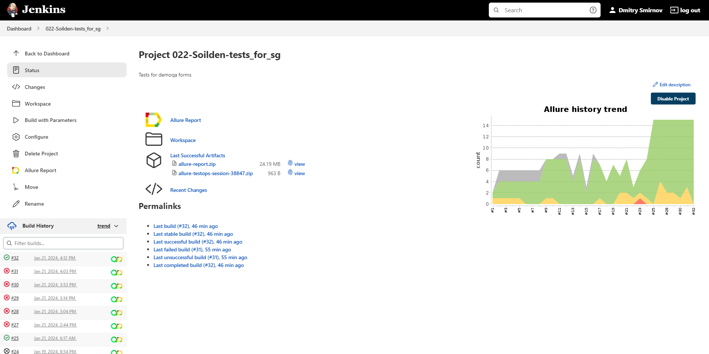
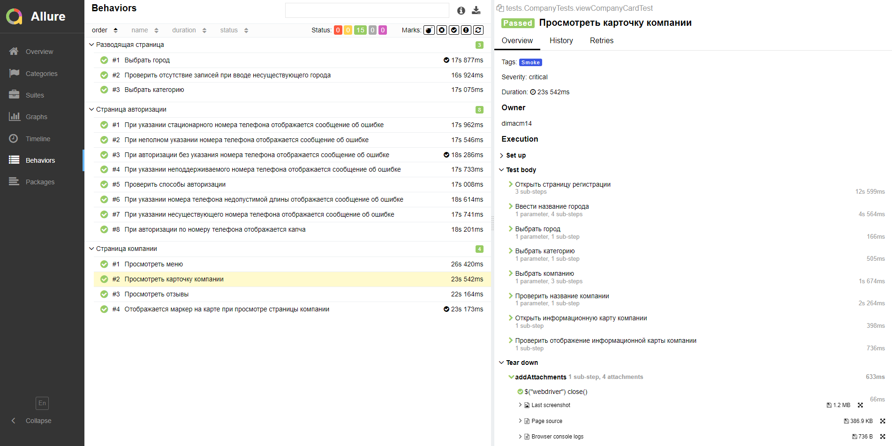
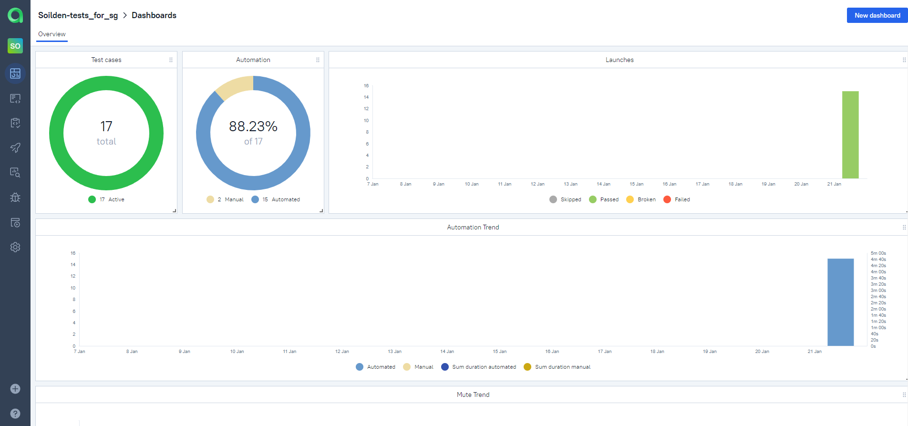
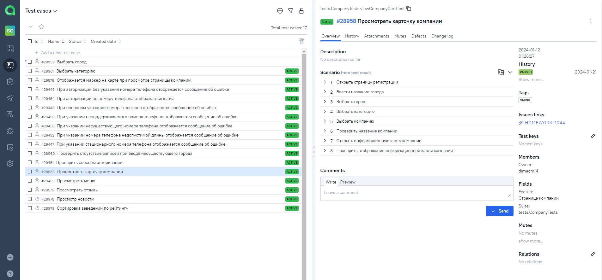
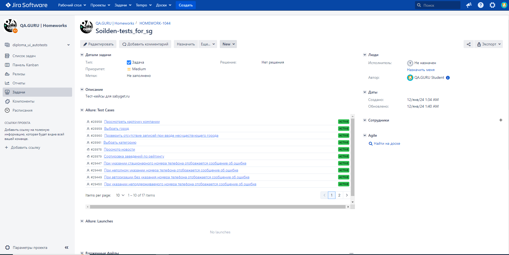
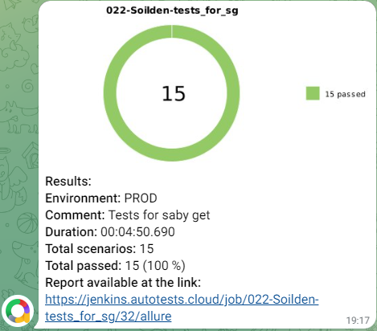

# <a href="https://sabyget.ru/"></a> Проект по автоматизации тестирования для <a href="https://sabyget.ru/">Sabyget.ru</a>.</h1>

## :technologist: Технологии и инструменты

<p  align="center">

<a href="https://www.jetbrains.com/idea/"></a>
<a href="https://www.java.com/"></a>
<a href="https://selenoid.autotests.cloud/"></a>
<a href="https://selenide.org/"></a>
<a href="https://gradle.org/"></a>
<a href="https://junit.org/junit5/"></a>
<a href="https://github.com/"></a>
<a href="https://allurereport.org/"></a>
<a href="https://qameta.io/"></a>
<a href="https://www.jenkins.io/"></a>
<a href="https://www.atlassian.com/ru/software/jira"></a>
<a href="https://web.telegram.org/"></a>
</p>


## :heavy_check_mark: Список проверок, реализованных в автотестах:

- [x] Выбор города
- [x] Отображение сообщения при попытке выбора несуществующего города
- [x] Выбор категории
- [x] Просмотр карточки компании
- [x] Авторизация с валидными данными
- [x] Добавление товара в избранное


## :heavy_check_mark: Список проверок, реализованных в ручных тестах

- [x] Просмотр новости
- [x] Сортировка заведений по рейтингу


## :rocket: Запуск тестов

###  :rocket: Локальный запуск :
```bash
gradle clean test
```

###  :rocket: Удаленный запуск (в Jenkins):
<p align="center">

</p>

1. Открыть <a target="_blank" href="https://jenkins.autotests.cloud/job/022-Soilden-tests_for_sg/">проект</a>
2. Нажать **Build with Parameters**
3. Результат запуска сборки можно посмотреть в отчёте Allure

## :triangular_flag_on_post: Allure отчеты:

### Отчет в </a> <a target="_blank" href="https://jenkins.autotests.cloud/job/022-Soilden-tests_for_sg/8/allure/"> Allure Report</a>

#### :black_small_square: Основной отчет
<p align="center">

</p>

#### :black_small_square: Тесты
<p align="center">

</p>

### Отчет в Allure </a> <a target="_blank" href="https://allure.autotests.cloud/project/3956/dashboards"> TestOps</a>

#### :black_small_square: Allure отчет
<p align="center">

</p>

#### :black_small_square: Тесты в Allure TestOps
<p align="center">

</p>


#### :black_small_square: Пример ручных тестов
<p align="center">
  
</p>

## Интеграция с Jira</a>
<p align="center">
  
</p>

## Telegram уведомления</a>

<p align="center">

</p>

##  Selenoid видеозапись тестов</a>
### Видеозапись прохождения тестов

<p align="center">
  
</p>
